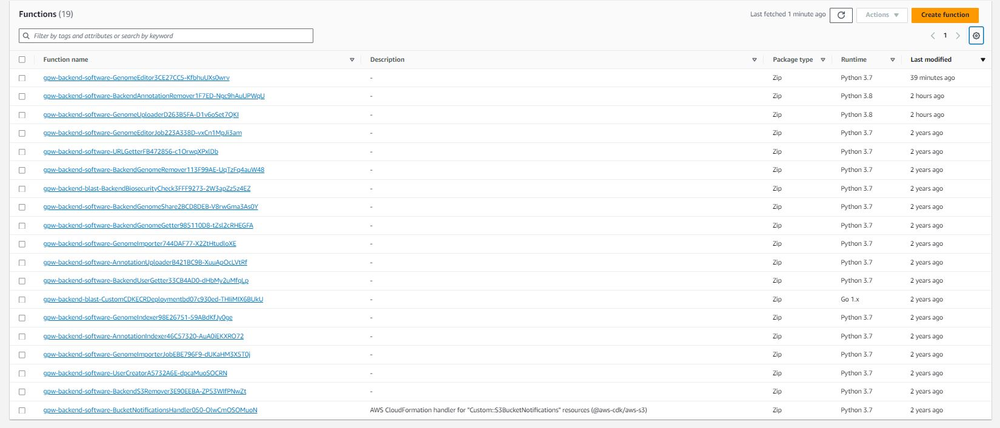

Creating New Python Layers
==========================

#### *October 30, 2023*

- Dominic sent an update on Python Lambda functions and layers

- In the AWS Console
  - 19 functions
  - 57 layers
- Only 17 functions in `software_stack.py`

- Dominic downloaded and shared the `Models.py` layer from a function in the AWS Console
  - It is currently running in Python 3.7
  - We need to upgrade the layers to Python 3.8 so the functions can run in 3.8

#### *October 31, 2023*

- Researched how to create a .zip file for a Lambda layer
  - AWS [Packaging your layer content](https://docs.aws.amazon.com/lambda/latest/dg/packaging-layers.html)
    - Might need to use [Cloud9](https://aws.amazon.com/cloud9/) to build .zip in a Linux environment
- Layers are packaged in a zip file
- Zip file is creating from zipping up a `python/` folder which contains layer dependencies and configuration

 

- Attempted to create zip file using instructions from ChatGPT (recommended by Dominic)
  - Created a `python/` folder and moved the `Models.py` file into it
  - used `python3.8 -m venv env` to create a virtual environment for Python 3.8
  - Only dependency in `Models.py` is `enum` which is a base library in Python so no dependency installation required
  - Used native macOS `zip` command to zip the folder
- Did not appear to be similar to the 3.7 layer
  - 3.7 layer did not have a virtual environment folder in the zip 
- Maybe the Models Layer zip file is only the `Models.py` file since there are no dependencies
